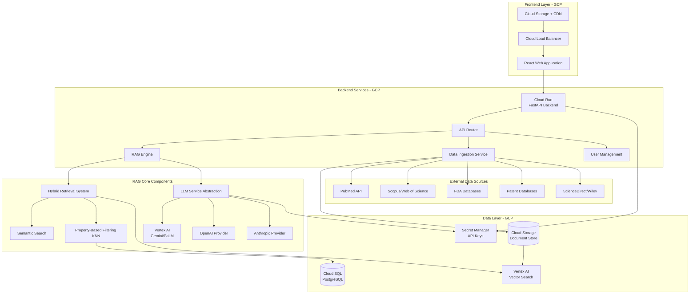
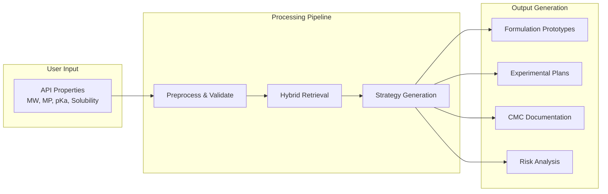

# RAG Formulation Development System - Project Plan

## Project Overview

This project implements a Retrieval-Augmented Generation (RAG) system to accelerate pharmaceutical formulation development by providing data-driven recommendations for drug solubility enhancement. The system addresses poor drug solubility (affecting ~90% of new drug candidates) through three formulation platforms: Lipid-Based Systems (SEDDS/SMEDDS), Nanosuspensions, and Amorphous Solid Dispersions (ASD).

## System Architecture

### High-Level Architecture (GCP Deployment)





### Component Architecture




## Technology Stack

### Backend

- **Framework**: FastAPI (Python 3.10+)
- **Vector Database**: 
- **Production**: Vertex AI Vector Search (GCP managed)
- **Development**: ChromaDB (local) or Vertex AI Vector Search
- **SQL Database**: 
- **Production**: Cloud SQL for PostgreSQL (GCP)
- **Development**: PostgreSQL (local)
- **ORM**: SQLAlchemy
- **Embeddings**: 
- Vertex AI Text Embeddings API (`textembedding-gecko@003`)
- OpenAI `text-embedding-3-large` (fallback)
- `sentence-transformers` (local fallback)
- **LLM Framework**: LangChain (primary) with Vertex AI integration
- **LLM Providers**:
- **Primary**: Vertex AI (Gemini Pro, PaLM 2)
- **Fallback**: OpenAI GPT-4, Anthropic Claude
- **Document Processing**: pypdf, python-docx, BeautifulSoup
- **Scientific Computing**: NumPy, Pandas, SciPy
- **API Client**: httpx, requests, google-cloud libraries
- **GCP Services**:
- `google-cloud-storage` - Document storage
- `google-cloud-secret-manager` - Secrets management
- `google-cloud-logging` - Logging
- `google-cloud-monitoring` - Monitoring
- `google-cloud-aiplatform` - Vertex AI integration

### Frontend

- **Framework**: React 18+ with TypeScript
- **UI Library**: Material-UI (MUI) or Ant Design
- **State Management**: React Query / TanStack Query
- **Forms**: React Hook Form
- **Charts**: Recharts or Chart.js
- **Build Tool**: Vite

### Infrastructure (GCP)

- **Containerization**: Docker & Docker Compose (local), Cloud Build (GCP)
- **Compute**:
- **Backend**: Cloud Run (serverless containers)
- **Frontend**: Cloud Storage + Cloud CDN (static hosting)
- **Data Processing**: Cloud Run Jobs (batch ingestion)
- **Storage**:
- **Documents**: Cloud Storage buckets
- **Database**: Cloud SQL for PostgreSQL
- **Secrets**: Secret Manager
- **Networking**:
- **Load Balancing**: Cloud Load Balancer
- **CDN**: Cloud CDN for frontend assets
- **VPC**: VPC for private Cloud SQL access
- **Monitoring & Logging**:
- **Logging**: Cloud Logging
- **Monitoring**: Cloud Monitoring
- **Tracing**: Cloud Trace (optional)
- **Error Reporting**: Error Reporting
- **CI/CD**: 
- **Primary**: Cloud Build with Cloud Build triggers
- **Alternative**: GitHub Actions with GCP integration
- **Environment Management**: Python virtualenv / Poetry
- **API Documentation**: FastAPI auto-generated Swagger/OpenAPI
- **Testing**: pytest (backend), Jest (frontend)

## Project Structure

```javascript
AIRag/
├── backend/
│   ├── app/
│   │   ├── __init__.py
│   │   ├── main.py                 # FastAPI application entry
│   │   ├── config.py               # Configuration management
│   │   ├── models/                 # SQLAlchemy models
│   │   │   ├── __init__.py
│   │   │   ├── user.py
│   │   │   ├── formulation.py
│   │   │   └── document.py
│   │   ├── schemas/                # Pydantic schemas
│   │   │   ├── __init__.py
│   │   │   ├── api_properties.py
│   │   │   ├── formulation.py
│   │   │   └── response.py
│   │   ├── api/                    # API routes
│   │   │   ├── __init__.py
│   │   │   ├── routes/
│   │   │   │   ├── formulation.py
│   │   │   │   ├── documents.py
│   │   │   │   └── user.py
│   │   ├── services/               # Business logic
│   │   │   ├── __init__.py
│   │   │   ├── rag_engine.py       # Main RAG orchestration
│   │   │   ├── retrieval.py        # Hybrid retrieval logic
│   │   │   ├── semantic_search.py  # Semantic search implementation
│   │   │   ├── property_filter.py  # KNN property filtering
│   │   │   ├── llm_service.py      # LLM abstraction
│   │   │   ├── embedding_service.py    # Embedding generation
│   │   │   └── strategy_generator.py # Formulation strategy generation
│   │   ├── data/                   # Data ingestion
│   │   │   ├── __init__.py
│   │   │   ├── ingestion/
│   │   │   │   ├── pubmed_ingester.py
│   │   │   │   ├── fda_ingester.py
│   │   │   │   ├── patent_ingester.py
│   │   │   │   └── document_processor.py
│   │   │   └── parsers/
│   │   │       ├── pdf_parser.py
│   │   │       ├── xml_parser.py
│   │   │       └── html_parser.py
│   │   └── utils/
│   │       ├── __init__.py
│   │       ├── validators.py
│   │       └── helpers.py
│   ├── tests/
│   │   ├── __init__.py
│   │   ├── test_rag_engine.py
│   │   ├── test_retrieval.py
│   │   └── test_api.py
│   ├── requirements.txt
│   ├── Dockerfile
│   └── .env.example
│
├── frontend/
│   ├── src/
│   │   ├── components/
│   │   │   ├── FormulationInput/
│   │   │   ├── ResultsDisplay/
│   │   │   ├── DocumentViewer/
│   │   │   └── RiskAnalysis/
│   │   ├── pages/
│   │   │   ├── Home.tsx
│   │   │   ├── Formulation.tsx
│   │   │   └── Documents.tsx
│   │   ├── services/
│   │   │   └── api.ts
│   │   ├── hooks/
│   │   │   └── useFormulation.ts
│   │   ├── types/
│   │   │   └── index.ts
│   │   └── App.tsx
│   ├── package.json
│   ├── Dockerfile
│   └── vite.config.ts
│
├── data/
│   ├── raw/                        # Raw ingested documents
│   ├── processed/                  # Processed/chunked documents
│   └── embeddings/                 # Cached embeddings
│
├── scripts/
│   ├── setup_database.py
│   ├── ingest_data.py
│   └── build_index.py
│
├── gcp/
│   ├── cloudbuild.yaml            # Cloud Build configuration
│   ├── app.yaml                   # App Engine config (optional)
│   ├── terraform/                 # Infrastructure as Code (optional)
│   │   ├── main.tf
│   │   ├── variables.tf
│   │   └── outputs.tf
│   └── deployment/
│       ├── deploy.sh              # Deployment script
│       └── setup-gcp.sh           # GCP setup script
│
├── doc/                            # Documentation (existing)
│   ├── Sumary.docx
│   └── RAG Plan V2 12282025.pdf
│
├── docker-compose.yml              # Local development
├── .gcloudignore                   # GCP ignore file
├── .gitignore
├── README.md
└── LICENSE
```


## Core Components

### 1. RAG Engine (`backend/app/services/rag_engine.py`)

- Orchestrates the entire RAG pipeline
- Coordinates hybrid retrieval (semantic + property-based)
- Manages LLM interactions
- Generates formulation strategies

### 2. Hybrid Retrieval System (`backend/app/services/retrieval.py`)

- **Semantic Search**: Uses vector similarity to find conceptually similar formulations
- **Property-Based Filtering**: KNN algorithm on chemical properties (MW, MP, pKa, LogP)
- **Fusion Strategy**: Combines results from both methods (reciprocal rank fusion or weighted combination)

### 3. LLM Service (`backend/app/services/llm_service.py`)

- Abstract interface supporting multiple providers (OpenAI, Anthropic, open-source)
- Handles prompt engineering for formulation strategy generation
- Manages context window and token limits

### 4. Data Ingestion Pipeline (`backend/app/data/ingestion/`)

- Modular ingesters for each data source
- Document parsing and chunking
- Metadata extraction (API properties, formulation type, outcomes)
- Vector embedding generation and storage

## Data Acquisition Strategy

Since data access is not currently available, the plan includes:

### Phase 1: Mock/Sample Data

- Create synthetic formulation datasets based on published literature examples
- Sample FDA IID data structure
- Mock patent data for testing

### Phase 2: Public Data Sources

- **PubMed**: Use `biopython` and `pymed` libraries for API access (free tier available)
- **FDA**: Scrape public FDA databases (Drugs@FDA, IID) - publicly available
- **Open Access Journals**: Harvest open-access papers from DOAJ, arXiv
- **PubChem**: Use PubChem API for chemical property data

### Phase 3: Licensed Data (Future)

- Integration points for Scopus/Web of Science APIs
- Patent database connectors (Derwent, USPTO)
- Commercial journal access

## Key Features Implementation

### 1. API Property Input & Validation

- Input form for: Molecular Weight, Melting Point, pKa, Solubility, LogP
- Validation against chemical property ranges
- Property calculation from SMILES if available

### 2. Hybrid Retrieval

- **Semantic Search**: 
- Embed query: "weak base with high melting point amorphous solid dispersion"
- Retrieve top-k similar documents from vector DB
- **Property-Based Filter**:
- Calculate similarity scores using weighted Euclidean distance on normalized properties
- Filter to top-k similar API properties
- **Fusion**: Combine and re-rank results

### 3. Strategy Generation

- LLM prompt includes:
- Retrieved precedents (top 5-10 similar cases)
- API properties
- Regulatory constraints (FDA IID limits)
- Failure mode warnings
- Generate 2-3 formulation prototypes per platform
- Include excipient ratios, processing conditions, stability considerations

### 4. Experimental Plan Generation

- Step-by-step experimental procedures
- Equipment specifications
- Analytical methods
- Success criteria

### 5. CMC Documentation

- Generate regulatory-ready documentation sections
- Include manufacturing controls
- Stability protocols
- Quality specifications

### 6. Risk Analysis

- Negative mining: Identify failure modes from retrieved data
- Flag potential issues (phase separation, precipitation, stability)
- Provide mitigation strategies

## GitHub Repositories & Models

### Core Libraries

1. **LangChain**: https://github.com/langchain-ai/langchain

- RAG framework, document loaders, vector store integrations

2. **LlamaIndex**: https://github.com/run-llama/llama_index

- Alternative RAG framework with advanced retrieval

3. **ChromaDB**: https://github.com/chroma-core/chroma

- Open-source vector database

4. **FastAPI**: https://github.com/tiangolo/fastapi

- Modern Python web framework

### Embedding Models

1. **OpenAI text-embedding-3-large**: Via API
2. **sentence-transformers**: https://github.com/UKPLab/sentence-transformers

- Models: `all-MiniLM-L6-v2`, `all-mpnet-base-v2`, `multi-qa-mpnet-base-dot-v1`

3. **BioBERT**: https://github.com/dmis-lab/biobert (domain-specific for biomedical text)

### LLM Models

1. **OpenAI GPT-4/GPT-3.5-turbo**: Via API
2. **Anthropic Claude**: Via API
3. **Open Source Options**:

- **Llama 2/3**: https://github.com/meta-llama/llama
- **Mistral**: https://github.com/mistralai/mistral-src
- **Zephyr**: https://huggingface.co/HuggingFaceH4/zephyr-7b-beta

### Scientific Data Libraries

1. **RDKit**: https://github.com/rdkit/rdkit (chemical informatics)
2. **PubChemPy**: https://github.com/mcs07/PubChemPy (PubChem API wrapper)
3. **pymed**: https://github.com/gijswobben/pymed (PubMed API)
4. **biopython**: https://github.com/biopython/biopython (bioinformatics)

### Reference Implementations

1. **LangChain RAG Examples**: https://github.com/langchain-ai/langchain/tree/master/templates
2. **LlamaIndex RAG Examples**: https://github.com/run-llama/llama_index/tree/main/examples
3. **Pharmaceutical RAG Systems**: Search for "drug discovery RAG" implementations

### GCP-Specific Resources

1. **Google Cloud Client Libraries**:

- **Python**: https://github.com/googleapis/google-cloud-python
- **Vertex AI SDK**: `google-cloud-aiplatform`
- **Storage**: `google-cloud-storage`
- **Secret Manager**: `google-cloud-secret-manager`
- **Cloud SQL**: `cloud-sql-python-connector`

2. **Vertex AI Documentation**:

- **Vector Search**: https://cloud.google.com/vertex-ai/docs/vector-search/overview
- **Text Embeddings**: https://cloud.google.com/vertex-ai/docs/generative-ai/embeddings/get-text-embeddings
- **Gemini Models**: https://cloud.google.com/vertex-ai/docs/generative-ai/model-reference/gemini

3. **Cloud Run Documentation**:

- **Getting Started**: https://cloud.google.com/run/docs/quickstarts
- **Container Deployment**: https://cloud.google.com/run/docs/deploying
- **Connecting to Cloud SQL**: https://cloud.google.com/sql/docs/postgres/connect-run

4. **Cloud Build**:

- **Documentation**: https://cloud.google.com/build/docs
- **Build Config Reference**: https://cloud.google.com/build/docs/build-config

5. **GCP Deployment Examples**:

- **FastAPI on Cloud Run**: https://github.com/GoogleCloudPlatform/python-docs-samples/tree/main/run/helloworld
- **React on Cloud Storage**: https://cloud.google.com/storage/docs/hosting-static-website

6. **Terraform GCP Modules** (Optional - for IaC):

- **Cloud SQL**: https://registry.terraform.io/modules/GoogleCloudPlatform/sql-db/google/latest
- **Cloud Run**: https://registry.terraform.io/modules/GoogleCloudPlatform/cloud-run/google/latest

## Execution Steps

### Phase 1: Project Setup (Week 1-2)

1. **Initialize Project Structure**

- Create directory structure
- Set up Python virtual environment
- Initialize React project with Vite
- Configure Docker and docker-compose

2. **Backend Foundation**

- Set up FastAPI application with basic routes
- Configure PostgreSQL database
- Set up SQLAlchemy models
- Create Pydantic schemas for API

3. **Frontend Foundation**

- Set up React + TypeScript project
- Configure routing
- Create basic UI components
- Set up API client service

### Phase 2: Core RAG Infrastructure (Week 3-4)

1. **Vector Database Setup**

- Install and configure ChromaDB
- Create vector store collections
- Set up embedding service

2. **Document Processing**

- Implement PDF, XML, HTML parsers
- Create document chunking strategy
- Build metadata extraction pipeline

3. **Retrieval System**

- Implement semantic search
- Implement property-based KNN filtering
- Create hybrid retrieval fusion logic

### Phase 3: LLM Integration (Week 5)

1. **LLM Service Abstraction**

- Create provider-agnostic interface
- Implement OpenAI provider
- Implement Anthropic provider
- Add open-source model support (optional)

2. **Prompt Engineering**

- Design prompts for formulation strategy generation
- Create templates for experimental plans
- Design CMC documentation templates

### Phase 4: Data Ingestion (Week 6-7)

1. **Mock Data Generation**

- Create synthetic formulation datasets
- Generate sample documents
- Populate vector database with test data

2. **Public Data Ingestion**

- Implement PubMed ingester
- Implement FDA database scraper
- Create PubChem property fetcher
- Build document processing pipeline

### Phase 5: RAG Engine Integration (Week 8)

1. **RAG Orchestration**

- Integrate retrieval with LLM service
- Implement strategy generation logic
- Add risk analysis module

2. **API Endpoints**

- Create formulation query endpoint
- Add document management endpoints
- Implement result caching

### Phase 6: Frontend Development (Week 9-10)

1. **Input Forms**

- API property input form
- Validation and error handling
- Property calculation from SMILES

2. **Results Display**

- Formulation strategy cards
- Experimental plan viewer
- CMC documentation display
- Risk analysis visualization

3. **UI/UX Polish**

- Responsive design
- Loading states
- Error handling
- User feedback

### Phase 7: Testing & Optimization (Week 11)

1. **Unit Tests**

- Test retrieval algorithms
- Test LLM service
- Test API endpoints

2. **Integration Tests**

- End-to-end RAG pipeline
- Frontend-backend integration

3. **Performance Optimization**

- Query optimization
- Caching strategies
- Embedding batch processing

### Phase 8: GCP Deployment (Week 12-13)

1. **GCP Project Setup**

- Create GCP project and enable required APIs:
- Cloud Run API
- Cloud SQL Admin API
- Vertex AI API
- Cloud Storage API
- Secret Manager API
- Cloud Build API
- Cloud Logging API
- Cloud Monitoring API
- Set up billing and IAM roles
- Configure service accounts with appropriate permissions

2. **Infrastructure Setup**

- **Cloud SQL**: 
- Create PostgreSQL instance
- Configure private IP (VPC)
- Set up database and users
- Configure backups
- **Cloud Storage**:
- Create buckets for documents (raw, processed)
- Set up lifecycle policies
- Configure CORS for frontend
- **Vertex AI Vector Search**:
- Create index endpoint
- Configure embedding model
- Set up index structure
- **Secret Manager**:
- Store API keys (OpenAI, Anthropic, etc.)
- Store database credentials
- Configure access policies

3. **Docker Configuration**

- Multi-stage Dockerfiles optimized for Cloud Run
- Docker Compose for local development
- Environment variable management using Secret Manager

4. **Cloud Build Setup**

- Create `cloudbuild.yaml` for automated builds
- Configure build triggers (GitHub push, manual)
- Set up build steps:
- Build Docker images
- Push to Container Registry
- Deploy to Cloud Run
- Run database migrations

5. **Cloud Run Deployment**

- Deploy backend service to Cloud Run
- Configure CPU/memory allocation
- Set concurrency limits
- Configure environment variables
- Set up health checks
- Configure auto-scaling
- Deploy frontend to Cloud Storage + CDN
- Build production React app
- Upload to Cloud Storage bucket
- Configure Cloud CDN
- Set up custom domain (optional)

6. **Networking & Security**

- Configure VPC connector for Cloud SQL access
- Set up Cloud Load Balancer (if needed)
- Configure CORS policies
- Set up Cloud Armor (DDoS protection, optional)

7. **Monitoring & Logging**

- Configure Cloud Logging for application logs
- Set up Cloud Monitoring dashboards
- Create alerting policies for:
- Error rates
- Latency
- Resource utilization
- Database connections

8. **Documentation**

- API documentation (auto-generated Swagger)
- User guide
- Developer setup guide
- GCP deployment guide
- Operations runbook

## External Steps (Wet Laboratory)

The wet laboratory experiments are **external** to this project and should be executed separately:

1. **Receive Formulation Recommendations** from the RAG system
2. **Prepare Formulations** according to generated experimental plans
3. **Conduct Experiments** (solubility testing, stability studies, etc.)
4. **Collect Results** and document outcomes
5. **Feedback Loop**: Input experimental results back into the system for continuous learning (future enhancement)

## Configuration Files

### Environment Variables

#### Local Development (.env)

```bash
# Database (Local PostgreSQL)
POSTGRES_HOST=localhost
POSTGRES_PORT=5432
POSTGRES_DB=formulation_rag
POSTGRES_USER=postgres
POSTGRES_PASSWORD=your_password

# Vector Database (Local ChromaDB)
CHROMA_HOST=localhost
CHROMA_PORT=8000
USE_VERTEX_VECTOR_SEARCH=false

# LLM Providers
OPENAI_API_KEY=your_key
ANTHROPIC_API_KEY=your_key
VERTEX_AI_PROJECT_ID=your-gcp-project-id
VERTEX_AI_LOCATION=us-central1

# Embeddings
EMBEDDING_MODEL=text-embedding-3-large
EMBEDDING_DIMENSION=3072
USE_VERTEX_EMBEDDINGS=false

# Application
API_HOST=0.0.0.0
API_PORT=8000
FRONTEND_URL=http://localhost:3000
ENVIRONMENT=development
```


#### GCP Production (Cloud Run Environment Variables)

```bash
# Database (Cloud SQL)
POSTGRES_HOST=/cloudsql/PROJECT_ID:REGION:INSTANCE_NAME
POSTGRES_PORT=5432
POSTGRES_DB=formulation_rag
POSTGRES_USER=formulation_user
# Password stored in Secret Manager

# Vector Database (Vertex AI)
USE_VERTEX_VECTOR_SEARCH=true
VERTEX_AI_PROJECT_ID=your-gcp-project-id
VERTEX_AI_LOCATION=us-central1
VERTEX_INDEX_ENDPOINT=projects/PROJECT_ID/locations/LOCATION/indexEndpoints/ENDPOINT_ID
VERTEX_INDEX_ID=your-index-id

# Cloud Storage
GCS_BUCKET_RAW=formulation-rag-raw-docs
GCS_BUCKET_PROCESSED=formulation-rag-processed-docs

# LLM Providers (stored in Secret Manager)
# Access via: google-cloud-secret-manager
SECRET_MANAGER_PROJECT_ID=your-gcp-project-id

# Embeddings
USE_VERTEX_EMBEDDINGS=true
VERTEX_EMBEDDING_MODEL=textembedding-gecko@003

# Application
ENVIRONMENT=production
FRONTEND_URL=https://your-domain.com
LOG_LEVEL=INFO

# Cloud Run
PORT=8080  # Cloud Run sets this automatically
```


#### Secret Manager Secrets

The following secrets should be stored in GCP Secret Manager:

- `postgres-password` - Cloud SQL password
- `openai-api-key` - OpenAI API key
- `anthropic-api-key` - Anthropic API key
- `database-connection-name` - Cloud SQL connection name

## GCP Deployment Quick Reference

### Essential GCP Commands

```bash
# Set project
gcloud config set project YOUR_PROJECT_ID

# Enable required APIs
gcloud services enable run.googleapis.com
gcloud services enable sqladmin.googleapis.com
gcloud services enable aiplatform.googleapis.com
gcloud services enable storage-api.googleapis.com
gcloud services enable secretmanager.googleapis.com
gcloud services enable cloudbuild.googleapis.com
gcloud services enable logging.googleapis.com
gcloud services enable monitoring.googleapis.com

# Create Cloud SQL instance
gcloud sql instances create formulation-rag-db \
  --database-version=POSTGRES_15 \
  --tier=db-f1-micro \
  --region=us-central1 \
  --network=default

# Create Cloud Storage buckets
gsutil mb -p YOUR_PROJECT_ID -c STANDARD -l us-central1 gs://formulation-rag-raw-docs
gsutil mb -p YOUR_PROJECT_ID -c STANDARD -l us-central1 gs://formulation-rag-processed-docs
gsutil mb -p YOUR_PROJECT_ID -c STANDARD -l us-central1 gs://formulation-rag-frontend

# Store secrets in Secret Manager
echo -n "your-password" | gcloud secrets create postgres-password --data-file=-
echo -n "your-openai-key" | gcloud secrets create openai-api-key --data-file=-

# Build and deploy with Cloud Build
gcloud builds submit --config=gcp/cloudbuild.yaml

# Deploy to Cloud Run
gcloud run deploy formulation-rag-api \
  --source . \
  --platform managed \
  --region us-central1 \
  --allow-unauthenticated \
  --set-env-vars="ENVIRONMENT=production" \
  --add-cloudsql-instances=YOUR_PROJECT_ID:us-central1:formulation-rag-db
```


### GCP Cost Estimation (Monthly)

**Development/Testing Environment:**

- Cloud Run: ~$10-30 (low traffic, 1-2 vCPU, 2GB RAM)
- Cloud SQL (db-f1-micro): ~$7-10
- Cloud Storage: ~$1-5 (depending on data volume)
- Vertex AI Vector Search: ~$50-100 (index creation + queries)
- Vertex AI API calls: ~$20-50 (embeddings + LLM)
- **Total: ~$88-195/month**

**Production Environment:**

- Cloud Run: ~$50-200 (auto-scaling, higher traffic)
- Cloud SQL (db-n1-standard-1): ~$50-100
- Cloud Storage: ~$10-50
- Vertex AI Vector Search: ~$200-500 (larger index, more queries)
- Vertex AI API calls: ~$100-300
- Cloud CDN: ~$10-30
- **Total: ~$420-1180/month**

*Note: Costs vary significantly based on usage, data volume, and traffic patterns. Use GCP Pricing Calculator for accurate estimates.*

### GCP Best Practices

1. **Security**:

- Use Secret Manager for all sensitive data
- Enable private IP for Cloud SQL
- Use IAM roles with least privilege
- Enable VPC Service Controls (optional, for enhanced security)

2. **Performance**:

- Use Cloud CDN for frontend assets
- Configure Cloud Run concurrency appropriately
- Enable Cloud SQL connection pooling
- Use Vertex AI Vector Search for production (not local ChromaDB)

3. **Cost Optimization**:

- Use committed use discounts for long-term usage
- Set up budget alerts
- Use Cloud Run min instances = 0 for dev (pay per use)
- Implement caching to reduce API calls

4. **Monitoring**:

- Set up Cloud Monitoring dashboards
- Create alerting policies for critical metrics
- Use Cloud Logging for debugging
- Enable Error Reporting

## Success Metrics

1. **Retrieval Accuracy**: Top-k precision on test queries
2. **Response Quality**: Expert evaluation of generated strategies
3. **Regulatory Compliance**: Percentage of recommendations within FDA IID limits
4. **Response Time**: Average query processing time < 30 seconds
5. **User Satisfaction**: Feedback scores on generated formulations
6. **GCP Performance**:

- Cloud Run cold start time < 5 seconds
- API response time p95 < 30 seconds
- Vector search query time < 2 seconds
- System uptime > 99.5%

## Future Enhancements

1. **Continuous Learning**: Incorporate experimental results to improve recommendations
2. **Multi-modal Support**: Image analysis for microscopy, XRD data
3. **Advanced Analytics**: Predictive modeling for formulation success probability